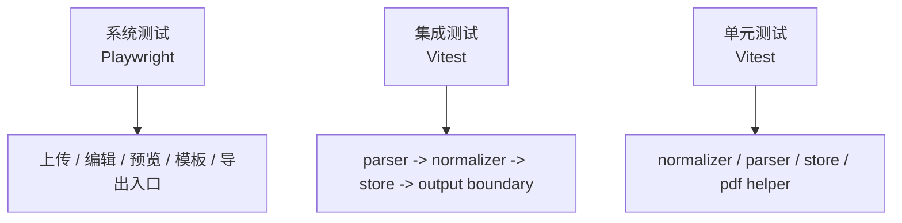

# 测试模块方案

## 目标

测试体系必须与 `docs/web-resume-editor-architecture.md` 的分层保持一致，并与功能模块同步开发。测试代码与生产代码分离：生产代码只放在 `frontend/src/`，测试代码统一放在 `frontend/tests/`。

本项目采用三层测试：

- 单元测试：验证单个函数、store action 或小模块。
- 集成测试：验证跨层数据链。
- 系统测试：验证真实浏览器用户流程。

## 测试金字塔



## 目录结构

```text
frontend/
  src/
    components/
    stores/
    types/
    utils/
    views/

  tests/
    unit/
      utils/
      stores/
    integration/
    system/
    fixtures/
      resumes/
    helpers/
    setup/
```

约束：

- 不在 `src/` 下放测试文件。
- fixtures 只服务测试，不被生产代码引用。
- helpers 只服务测试，不被生产代码引用。

## 工具

| 测试层 | 工具 | 说明 |
|---|---|---|
| 单元测试 | Vitest | 快速验证纯逻辑和 store action |
| 集成测试 | Vitest + Vue Test Utils | 验证组件边界和跨模块数据流 |
| 系统测试 | Playwright | 启动真实浏览器验证主流程 |
| DOM 模拟 | happy-dom | 为 Vitest 提供轻量 DOM 环境 |
| 覆盖率 | `@vitest/coverage-v8` | 后续需要时生成覆盖率报告 |

## 单元测试范围

### 数据归一化

文件示例：`frontend/tests/unit/utils/resume-normalizer.test.ts`

覆盖：

- 缺字段补默认值。
- 数组字段兜底。
- 空技能、空详情行清理。
- `detailsRaw -> details`。
- `details -> detailsRaw`。
- 幂等性。
- 保留 `photo` 数据，不做图片处理。

### Markdown Parser

文件示例：`frontend/tests/unit/utils/parser.test.ts`

覆盖：

- 姓名。
- 邮箱。
- 电话。
- 目标岗位。
- 教育经历。
- 工作经历。
- 项目经历。
- 技能。

### PDF Helper

文件示例：`frontend/tests/unit/utils/pdf.test.ts`

覆盖：

- `estimatePdfPages()` 最少返回 1 页。
- 按 A4 比例计算页面高度。
- 使用 `scrollHeight` 和 `getBoundingClientRect().height` 中较大的内容高度。

### Store

文件示例：`frontend/tests/unit/stores/resume-store.test.ts`

覆盖：

- `setResume()` 接入归一化。
- 目标岗位变化触发模板推断。
- 模板手动锁定后不被自动覆盖。
- photo / education / experience / project / skills 的 add、update、remove。
- `detailsRaw` 与 `details` 同步。
- 编辑中的空行可以临时保留。

## 集成测试范围

文件示例：

- `frontend/tests/integration/resume-data-flow.test.ts`
- `frontend/tests/integration/resume-export-flow.test.ts`

覆盖链路：

```text
Markdown fixture
  -> parseMarkdown()
  -> normalizeResume()
  -> resume store
  -> preview/export boundary input
```

导出边界测试：

- PDF 仍然通过预览 DOM 导出。
- `ExportActions` 正确包装 PDF 导出能力。
- DOCX 当前为禁用占位入口，不生成真实文件。

## 系统测试范围

系统测试使用 Playwright，文件放在 `frontend/tests/system/`。

覆盖：

- 上传 Markdown fixture 后进入编辑状态。
- 编辑姓名、邮箱、目标岗位、摘要后预览同步更新。
- 新增/编辑技能和经历详情后预览同步。
- 切换模板后预览模板 class 更新。
- PDF 导出入口可用。
- DOCX 占位按钮禁用。
- 长简历仍显示页数提示，且 PDF 导出入口可用。

系统测试应优先使用 `data-testid`，避免依赖中文文案和样式类名。

## NPM Scripts

```json
{
  "typecheck": "vue-tsc -p tsconfig.app.json --noEmit",
  "typecheck:tests": "vue-tsc -p tsconfig.tests.json --noEmit",
  "build": "npm run typecheck && vite build",
  "test": "vitest run --config vitest.config.ts",
  "test:watch": "vitest --config vitest.config.ts",
  "test:unit": "vitest run --config vitest.config.ts tests/unit",
  "test:integration": "vitest run --config vitest.config.ts tests/integration",
  "test:coverage": "vitest run --config vitest.config.ts --coverage",
  "test:system": "playwright test --config playwright.config.ts",
  "test:system:ui": "playwright test --config playwright.config.ts --ui",
  "test:all": "npm run typecheck && npm run typecheck:tests && npm run test && npm run test:system"
}
```

## 并行开发要求

采用“功能模块 + 测试模块”垂直切片：

| 功能模块 | 同批测试 |
|---|---|
| 数据归一化模块 | normalizer unit + data-flow integration |
| Store 编辑 API | store unit + 编辑链路 integration |
| 导出入口模块 | export integration + export system |
| UI 可测性 | upload/editor/template system |
| 测试基础设施 | smoke test |

不接受以下交付方式：

- 只开发功能，不写对应测试。
- 只补测试，不明确对应功能边界。
- 测试代码混入 `src/`。

## 当前阻塞记录

测试依赖已在 `frontend/package.json` 声明，但当前环境中依赖安装被阻塞：

```text
npm install -D vitest @vitest/coverage-v8 @vue/test-utils happy-dom @playwright/test @types/node
```

阻塞原因：

- npm 需要写入用户级 cache 目录时出现权限错误。
- Escalated install 请求被审批器拒绝。

影响：

- `npm run build` 可以通过。
- `npm run typecheck` 可以通过。
- `npm run typecheck:tests` 会因为缺少 `vitest`、`@playwright/test`、`@types/node` 类型失败。
- `npm run test:*` 会因为依赖未安装失败。

解除方式：

- 允许在 `frontend/` 下执行依赖安装并更新 `package-lock.json`。
- 安装 Playwright Chromium：`npx playwright install chromium`。
