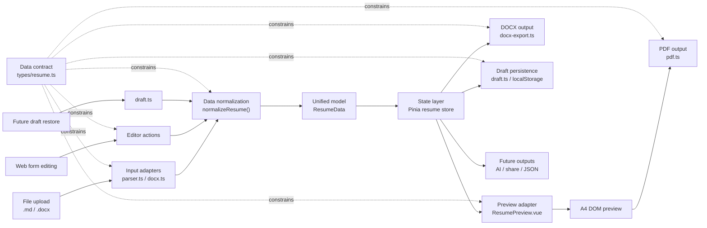

# Web Resume Editor Architecture

## Purpose

This document records the target architecture for the web-based resume editing capability. It is meant to guide the next implementation phase: modularizing the current editor, preparing PDF/DOCX output boundaries, and keeping the data flow readable and stable.

The current project should remain a browser-first resume tool. User resume data is parsed, edited, previewed, and exported locally unless a later ADR explicitly introduces server-side capabilities.

## Layered Architecture

```text
Input layer
  File upload
  Web form editing
  Future draft restore

Input adapter layer
  Markdown parser
  DOCX parser
  Editor actions
  Draft loader

Data normalization layer
  Fill defaults
  Clean empty values
  Normalize arrays
  Convert editor-friendly fields into canonical fields
  Preserve compatibility with old drafts or parser output

Unified data model
  ResumeData

State layer
  Pinia resume store

Output adapter layer
  Web preview
  PDF export
  DOCX export
  Draft persistence
  Future AI/share/export integrations
```

## Data Flow



## Data Contract Module

The data contract module defines the standard shape of resume data. In the current project this is `frontend/src/types/resume.ts`.

Its responsibility is to answer one question: what does a valid standard resume object look like inside the application?

It should contain stable type definitions such as:

```text
ResumeData
Education
Experience
Project
CareerTemplate
```

It may contain small constants that are part of the contract, but it should not contain runtime data processing. It should not parse Markdown, inspect DOCX XML, manipulate DOM, generate PDF/DOCX files, compress images, or manage localStorage.

Every input and output module should depend on this contract instead of depending on each other. That keeps the system extensible: Markdown, DOCX, web form editing, preview, PDF, DOCX, drafts, and future integrations all speak the same internal language.

## Data Normalization Module

The data normalization module is separate from the data contract. A future file such as `frontend/src/utils/resume-normalizer.ts` should own this responsibility.

Its job is to convert incomplete, dirty, legacy, or source-specific data into a clean `ResumeData` object.

This distinction matters:

```text
Data contract defines the standard.
Data normalization makes real input conform to the standard.
```

## Module Split Target

Recommended component boundaries:

```text
frontend/src/views/HomeView.vue
frontend/src/components/upload/FileUpload.vue
frontend/src/components/editor/ResumeEditor.vue, BasicInfoEditor.vue, PhotoEditor.vue, EducationEditor.vue, ExperienceEditor.vue, ProjectEditor.vue, SkillsEditor.vue
frontend/src/components/preview/ResumePreview.vue, TemplateSwitcher.vue
frontend/src/components/export/ExportActions.vue, PDFExporter.vue, DocxExporter.vue
```

## Output Boundaries

PDF uses DOM preview → html2canvas → jsPDF. DOCX is generated from ResumeData.

Draft persistence consumes normalized ResumeData. Draft loading passes through normalization.

## Implementation Guidance

- Keep ResumeData as the single normalized internal model.
- Introduce resume-normalizer.ts before adding more input or output paths.
- Move editor list operations into store actions.
- Do not introduce a backend for this refactor.
