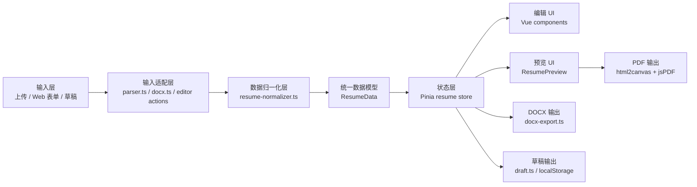

# 技术方案

## 目标

本项目继续采用浏览器本地处理的纯前端方案。技术选型必须适配 `docs/web-resume-editor-architecture.md` 中定义的分层架构：输入层、输入适配层、数据归一化层、统一数据模型、状态层和输出适配层。

核心原则：

- 不为当前阶段引入后端服务。
- 不重写技术栈。
- 所有输入先归一化为 `ResumeData`。
- 所有输出适配器消费 `ResumeData` 或预览 DOM。
- 功能模块和测试模块同步开发。

## 技术栈

| 层级 | 技术 | 作用 |
|---|---|---|
| UI 框架 | Vue 3 | 页面、编辑器、预览和导出入口 |
| 语言 | TypeScript | 数据契约、工具函数、状态和测试类型约束 |
| 构建 | Vite | 本地开发、生产构建、预览服务 |
| 状态管理 | Pinia | 当前简历数据、模板状态、编辑 action |
| 样式 | scoped CSS 为主，Tailwind 可辅助 | 保持现有视觉稳定，局部组件样式隔离 |
| Markdown 输入 | `parser.ts` | Markdown 简历转结构化数据 |
| DOCX 输入 | `docx.ts` + JSZip | 浏览器端读取 `.docx` 文本和图片 |
| 数据归一化 | `resume-normalizer.ts` | 默认值、数组兜底、空项清理、详情同步 |
| PDF 输出 | `ResumePreview` DOM + html2canvas + jsPDF | 保持网页预览和 PDF 视觉一致 |
| DOCX 输出 | 后续 `docx-export.ts` | 从 `ResumeData` 生成可编辑、ATS 友好的 DOCX |
| 草稿 | 后续 `draft.ts` + localStorage | 本地草稿保存和恢复 |
| 单元/集成测试 | Vitest | 纯逻辑、store、数据流、组件边界 |
| 系统测试 | Playwright | 浏览器内上传、编辑、预览、导出入口流程 |

## 架构适配



### Vue 3

Vue 3 继续作为 UI 层基础。简历编辑器是典型的表单密集型应用，适合拆分为上传、编辑区块、预览和导出组件。当前项目已经稳定运行在 Vue 3 上，继续使用的迁移成本最低。

### TypeScript

TypeScript 是统一数据模型的基础。`ResumeData`、`Education`、`Experience`、`Project` 和 `CareerTemplate` 构成系统内部的数据契约。新增输入、输出或草稿能力时，必须先对齐该契约。

### Pinia

Pinia 作为状态层，负责当前简历数据、模板选择和编辑 action。组件不应散落复杂的 `push`、`splice`、`detailsRaw -> details` 同步逻辑；这些逻辑应收敛到 store action 或数据归一化工具。

### 数据归一化

`resume-normalizer.ts` 是当前架构中最关键的新模块。它是纯 TypeScript 工具层，不依赖 Vue、Pinia、DOM、文件读取或导出逻辑。

职责：

- 补齐默认字段。
- 保证数组字段稳定。
- 清理空技能和空详情行。
- 同步 `detailsRaw` 与 `details`。
- 兼容 parser 输出、草稿恢复和整体替换输入。

边界：

- 不解析 Markdown。
- 不读取 DOCX。
- 不推断模板。
- 不修改 Pinia 状态。
- 不生成 PDF/DOCX。

## 输出策略

### PDF

PDF 继续从 `ResumePreview` 的 A4 DOM 生成：

```text
ResumeData -> ResumePreview DOM -> html2canvas -> jsPDF -> PDF
```

这样能保持网页预览和 PDF 导出视觉一致。风险是长简历分页、图片和 canvas 清晰度，需要系统测试和人工抽查持续验证。

### DOCX

DOCX 后续从 `ResumeData` 直接生成：

```text
ResumeData -> docx-export.ts -> DOCX
```

DOCX 的目标是可编辑、结构清晰、ATS 友好，不追求与网页模板像素级一致。当前阶段只保留禁用占位入口，不实现真实 DOCX 文件生成。

## 运行与维护成本

| 方案 | 适配度 | 开发成本 | 运行成本 | 维护成本 | 结论 |
|---|---:|---:|---:|---:|---|
| 纯前端 Vue 方案 | 高 | 中低 | 低 | 中低 | 当前采用 |
| Vue + 后端服务 | 中 | 高 | 中高 | 高 | 后续云端能力再评估 |
| Next.js / React 重构 | 低 | 高 | 中 | 中高 | 不采用 |
| Electron 桌面端 | 低 | 高 | 低 | 高 | 不符合当前 Web 目标 |

当前技术栈与项目现状匹配度最高。主要维护风险不来自框架，而来自模块边界不清和测试缺失。因此当前优先级是模块拆分、归一化层、store action 和测试体系。

## 开发约束

- 生产代码放 `frontend/src/`。
- 测试代码放 `frontend/tests/`。
- 新增功能模块必须同批新增测试模块。
- 不在 `src/` 中放 `*.test.ts`。
- 不手写生成型 lockfile；依赖安装由 npm 生成 `package-lock.json`。
- Playwright 使用 `127.0.0.1`，避免 Windows 环境下 localhost 解析差异。
